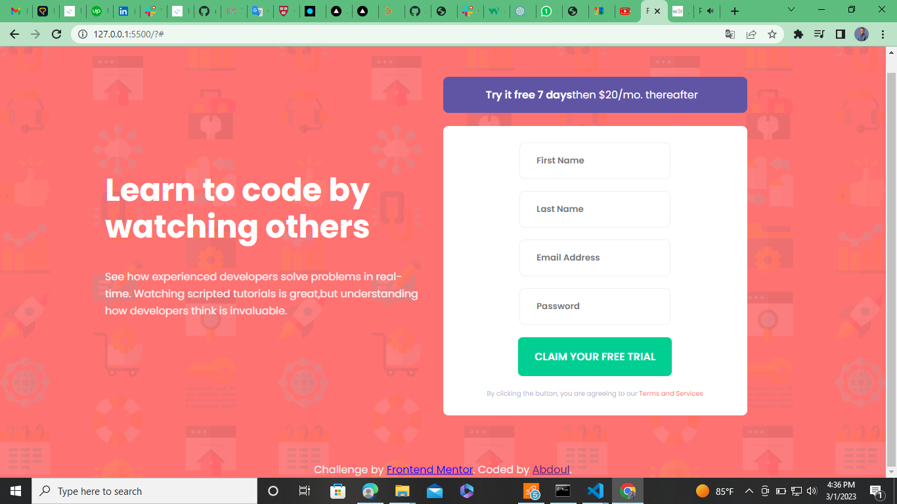

## Overview
- PROJECT SIGN UP FORM
Welcome to my project sign-up form! This form allows users to create an account and sign up for my project.

# Features

- User-friendly form for easy account creation
- Password strength checker to ensure secure passwords
- Email verification to prevent spam accounts
- Error messages for incorrect form submissions

### Screenshot

### Links

- Solution URL: (https://github.com/aradradev/intro-componenet-sign-up-form.git)
- Live Site URL: (https://your-live-site-url.com)

## My process

### Built with
# Technologies Used
- HTML
- CSS
- JavaScript

**Note: These are just examples. Delete this note and replace the list above with your own choices**

# Installation
To use this sign-up form on your website, simply download the code.

### Continued development

# Contributions
I welcome contributions from the community. If you have any suggestions or would like to report a bug, please submit an issue or pull request on GitHub.

### Useful resources

- (https://chat.openai.com/chat) - This helped me for implement the function that I didn't have any idea. I really liked this openai and will use it going forward.
- (https://www.w3resource.com/javascript/form/email-validation.php) - This is an amazing article which helped me finally understand To get a valid email id I use a regular expression. I'd recommend it to anyone still learning this concept.

## Author

- Website - (https://github.com/aradradev)
- Frontend Mentor - (https://www.frontendmentor.io/profile/aradradev)
- Twitter - (https://twitter.com/Abdoul_2023)
